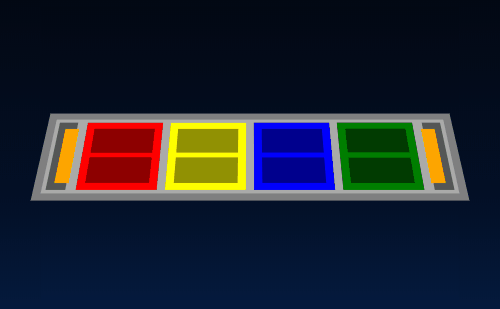
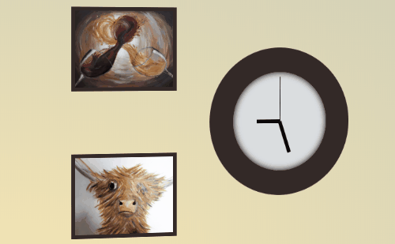
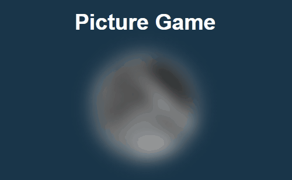
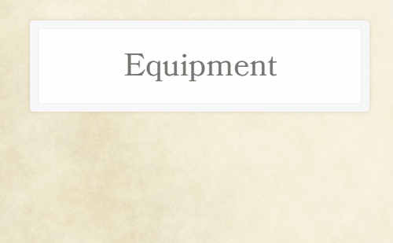

 

# JavaScript30

Solutions to the [JavaScript30](https://javascript30.com) course by [Wes Bos](https://github.com/wesbos). Starter files are from the [JavaScript30 starter repository](https://github.com/wesbos/JavaScript30).

Exercise | Demo
--------------|--------------
[**Drum Kit**](exercises/01-drum-kit) A drumkit made to look like the Rock Band 4 drum lane|
[**Clock**](exercises/02-clock) A recreation of a relative's gallery clock wall|
[**CSS Variables**](exercises/03-css-variables) A photo game where change the focus, rotation, and border color of an image|
[Array Cardio 1](exercises/04-array-cardio-1/script.js) A short exercise on array functions like `filter()`, `map()`, `sort()`, and `reduce()`|
[**Flex Panel Gallery**](exercises/05-flex-panel-gallery) A gallery that displays *Magic: the Gathering* art illustrated by John Avon|
[**Type Ahead**](exercises/06-type-ahead) Am equipment search and autocomplete tool for Dungeons & Dragons|
[Array Cardio 2](exercises/07-array-cardio-2/script.js) A short exercise on array functions like `some()`, `every()`, `find()`, and `findIndex()`|
[**Canvas**](exercises/08-canvas) A rainbow drawing tool that uses the `<canvas>` element|
[Dev Tools](exercises/09-dev-tools) A short exercise with some Chrome Dev Tools tips|